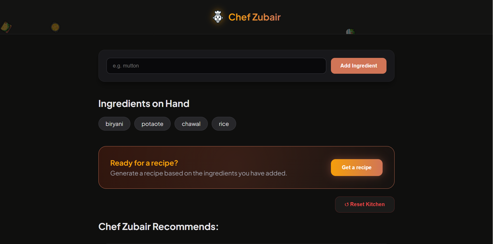
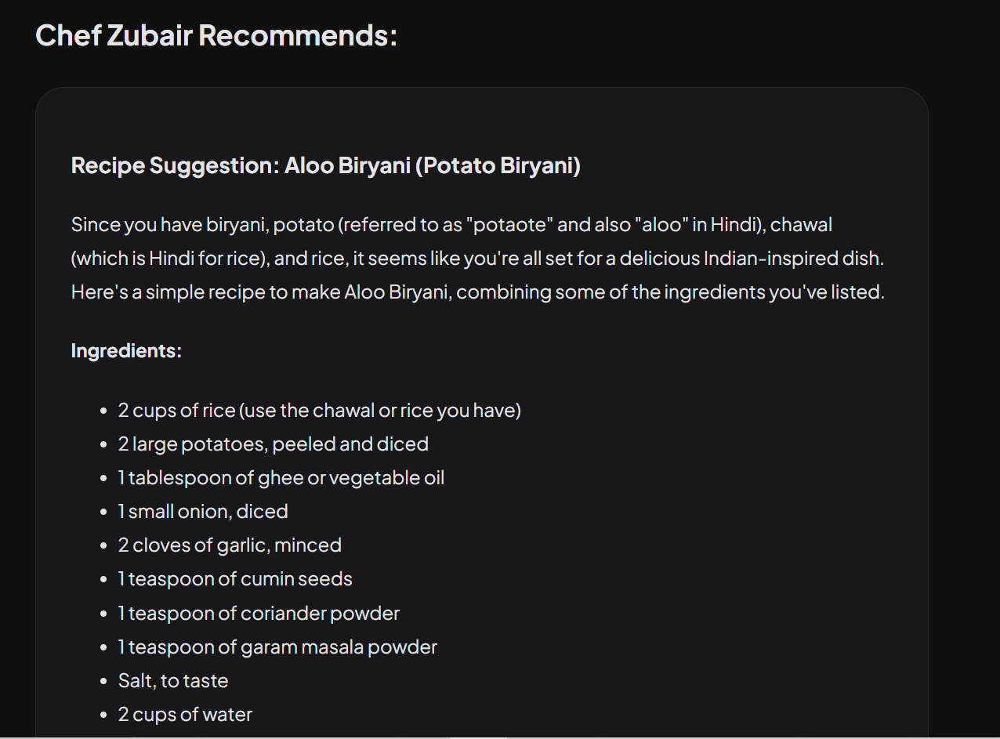

# 🍳 Chef Zubair - AI Recipe Generator 
 [🚀 Live Demo](https://chef-zubair.onrender.com)
 ## 📱 Download the App

Experience Chef Zubair on your Android device with our official APK.

### 📥 Direct Download
[](https://github.com/Muhammad-Zubair796/Chef-Zubair-React-App/releases/download/v1.0.0/Chef-Zubair-v1.0.apk)

> **Note:** Since this is a self-signed APK, your phone might show a "Blocked by Play Protect" warning. Click **"Install Anyway"** to proceed.

A modern, high-performance React application that uses **AI (Grok)** to help users generate delicious recipes from the ingredients they have in their kitchen.


---

## ✨ Features

* **🤖 AI Integration:** Uses Grok AI to provide step-by-step cooking instructions.
* **🔥 Immersive UI:** Features a dark-themed "Fire" dashboard with smooth CSS animations.
* **🎈 Flying Icons:** Dynamic header with floating food emojis for a playful user experience.
* **♻️ Reset Kitchen:** Easily clear your workspace to start a fresh recipe.

---

## 🚀 Installation & Setup

1.  **Clone the Repository:**
    ```bash
    git clone [https://github.com/Muhammad-Zubair796/Chef-Zubair-React-App.git](https://github.com/Muhammad-Zubair796/Chef-Zubair-React-App.git)
    ```

2.  **Install Dependencies:**
    ```bash
    npm install
    ```

3.  **Environment Variables:**
    Create a `.env` file in the root directory and add your API key:
    ```env
    VITE_GROK_API_KEY=your_key_here
    ```

4.  **Run Development Server:**
    ```bash
    npm run dev
    ```

---

## 🛠 Tech Stack

* **Frontend:** React.js (Vite)
* **Styling:** Modern CSS3 with Custom Animations
* **API:** Grok AI (X.ai)
* **Icons:** Custom Emoji Vectors

---
## 📸 Screenshots

| Adding Ingredients | AI Generating Recipe |
| :---: | :---: |
|  |  |

---
## 
## 👨‍💻 Developed By

**Muhammad Zubair**
* GitHub: [@Muhammad-Zubair796](https://github.com/Muhammad-Zubair796)
